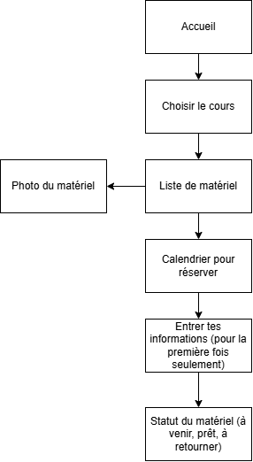

# app-reservation
# Nom de l'application

Projet conçu en équipe avec : Nicholas

## Le problème

- Problème : Difficulté à réserver les matériaux et à respecter le 48h ouvrable
- Persona : Un étudiant de TIM souhaite réserver des matériaux, mais le nombres d'étapes et de règles sont trop pour lui. De plus, comme il n'a pas accès à un ordinateur chez lui, il doit le faire sur son portable, qui est très difficile, vu qu'il devrait télécharger un excel.
Il souhaite avoir un appli qui fera le 48h ouvrable pour lui et qui nécessite moins d'étapes. Il aimerait aussi la possibilité de savoir ce que le matériel ressemble afin de bien réserver le bon truc.

## La solution

- Proposition de valeur : Permet de faire la réservation plus rapidement et facilement
- Fonctionnalités du MVP : Boutons pour sélectionner le matériel requis, calendrier avec heure qui permet de choisir la date de sortie et retour tout en respectant la règle de 48h ouvrables, image du matériel (exemple : image d'appareil photo au dessus du matériel), suivi du matériel auprès de l'étudiant et du professeur, l'appli connait tes informations comme le No de DA, ton nom et le groupe.

## L'expérience

- Direction artistique : couleurs #......, #......, #...... et police ...
- Sur téléphone et sur ordinateur : ...
- 
## La demande

Nous demandons ... $ pour ...
